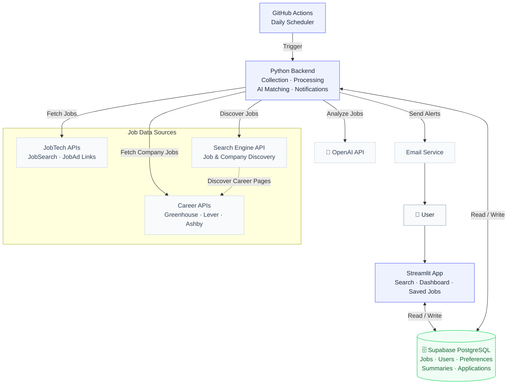

## System Architecture

```mermaid
flowchart TB
    %% Styling
    classDef default fill:#F8FAFC,stroke:#94A3B8,color:#1E293B,stroke-width:1px;
    classDef primary fill:#EEF2FF,stroke:#818CF8,color:#1E293B,stroke-width:1.5px;
    classDef database fill:#F0FDF4,stroke:#4ADE80,color:#166534,stroke-width:1.5px;
    classDef external fill:#F8FAFC,stroke:#CBD5E1,color:#334155,stroke-width:1px;

    %% User Interface
    User["👤 User"]
    App["Streamlit App<br/>Search · Dashboard · Saved Jobs"]

    %% Storage
    DB[("🗄️ Supabase PostgreSQL<br/>Jobs · Users · Preferences<br/>Summaries · Applications")]

    %% Scheduling
    Scheduler["GitHub Actions<br/>Daily Scheduler"]

    %% Backend
    Backend["Python Backend<br/>Collection · Processing<br/>AI Matching · Notifications"]

    %% External Job Sources
    subgraph Sources["Job Data Sources"]
        direction LR
        JobAPI["JobTech APIs<br/>JobSearch · JobAd Links"]
        SearchEngine["Search Engine API<br/>Job & Company Discovery"]
        CareerAPI["Career APIs<br/>Greenhouse · Lever · Ashby"]
    end

    %% External Services
    AI["🤖 OpenAI API"]
    Email["Email Service"]

    %% Main Flow
    User --> App
    App <-->|Read / Write| DB

    Scheduler -->|Trigger| Backend
    Backend <-->|Read / Write| DB

    %% Job Collection
    Backend -->|Fetch Jobs| JobAPI
    Backend -->|Discover Jobs| SearchEngine
    Backend -->|Fetch Company Jobs| CareerAPI

    SearchEngine -.->|Discover Career Pages| CareerAPI

    %% AI & Notifications
    Backend -->|Analyze Jobs| AI
    Backend -->|Send Alerts| Email
    Email --> User

    %% Node Styles
    class App,Backend,Scheduler primary;
    class DB database;
    class JobAPI,SearchEngine,CareerAPI,AI,Email external;
```