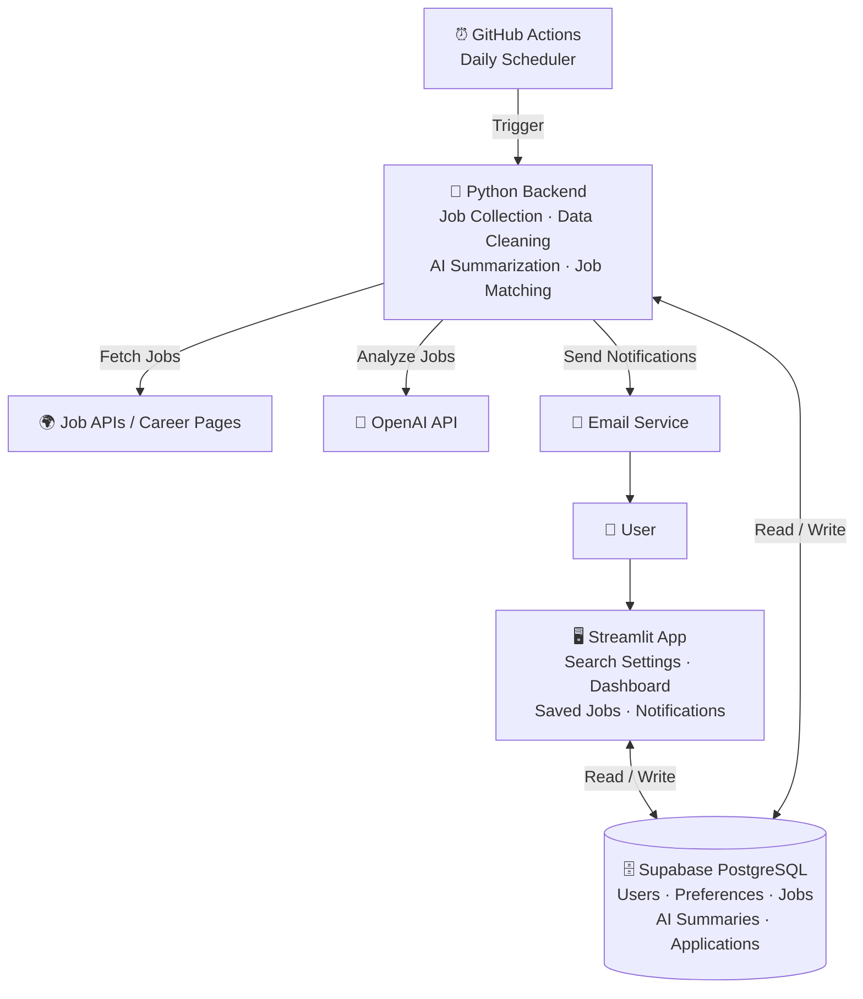

## 🏗️ System Architecture

```mermaid
flowchart TD
    User["👤 User"]

    App["🖥️ Streamlit App<br/>Search Settings · Dashboard<br/>Saved Jobs · Notifications"]

    DB[("🗄️ Supabase PostgreSQL<br/>Users · Preferences · Jobs<br/>AI Summaries · Applications")]

    Scheduler["⏰ GitHub Actions<br/>Daily Scheduler"]

    Backend["🐍 Python Backend<br/>Job Collection · Data Cleaning<br/>AI Summarization · Job Matching"]

    JobAPI["🌍 Job APIs / Career Pages"]
    AI["🤖 OpenAI API"]
    Email["📧 Email Service"]

    User --> App
    App <-->|Read / Write| DB

    Scheduler -->|Trigger| Backend

    Backend <-->|Read / Write| DB
    Backend -->|Fetch Jobs| JobAPI
    Backend -->|Analyze Jobs| AI
    Backend -->|Send Notifications| Email

    Email --> User
```